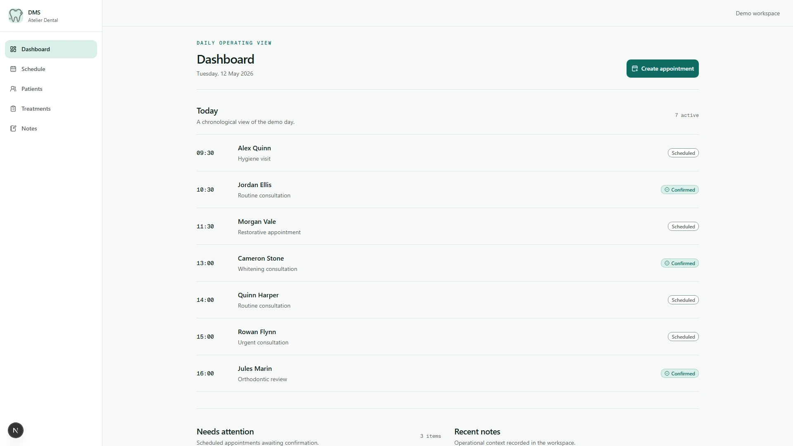

# DMS

> A public portfolio demo of a dental practice operations workspace.

DMS brings appointments, patient records, treatments, and operational notes into one calm workspace for a single dental practice. This public edition presents a modern demo of a system developed with a small team for a dental client; every practice, person, and record shown here is fictional.

## Screenshots

### Public entry

| Case study                                                                                                | Demo access                                                                                             |
| --------------------------------------------------------------------------------------------------------- | ------------------------------------------------------------------------------------------------------- |
|  |  |

### Daily operations



### Core workflows

| Weekly schedule                                                                   | Patient record                                                                                              |
| --------------------------------------------------------------------------------- | ----------------------------------------------------------------------------------------------------------- |
|  |  |

## Key capabilities

- **Appointment coordination:** Create, reschedule, confirm, complete, or cancel appointments while preventing conflicting active slots.
- **Patient directory:** Find, add, edit, archive, and review patients within the sample practice.
- **Connected records:** Keep appointment activity, treatment context, and concise operational notes together on each patient record.
- **Guided public access:** Open a server-provisioned demo session without a public sign-up flow; an operator can restore the fictional workspace from its curated baseline when needed.

## Engineering highlights

- **Domain rules remain close to persistence.** Small services and PostgreSQL-backed data protect practice ownership, appointment conflicts, and archive constraints.
- **The public demo is intentionally bounded.** A deterministic clock and resettable seed keep every walkthrough, screenshot, and test run consistent.
- **Authentication is purpose-built for exploration.** Better Auth provisions a server-side demo identity and protects workspace routes without exposing credentials in the interface.
- **Quality checks cover the important boundaries.** Vitest verifies rules and PostgreSQL integration; Playwright covers the main workflow and automated WCAG checks; GitHub Actions runs the release checks.

## Architecture

```text
Browser -> Next.js App Router -> Better Auth + Zod service layer -> Drizzle ORM -> PostgreSQL
```

The application is a modular monolith: server-rendered routes and route handlers compose focused domain services, while Drizzle owns PostgreSQL access and SQL migrations.

## Technology stack

- **Application:** Next.js App Router, React, TypeScript, and Tailwind CSS.
- **Data and identity:** PostgreSQL, Drizzle ORM, Drizzle Kit, Better Auth, and Zod.
- **Tooling:** pnpm, Vitest, Playwright, Prettier, GitHub Actions, and Docker Compose.

## Repository structure

| Path                   | Responsibility                                                         |
| ---------------------- | ---------------------------------------------------------------------- |
| `src/app`              | App Router pages, route handlers, metadata, and workspace routes.      |
| `src/components`       | Product UI, accessible primitives, and client interactions.            |
| `src/lib`              | Domain services, validation, authentication, and demo infrastructure.  |
| `src/db` and `drizzle` | Drizzle schema, deterministic seed data, and versioned SQL migrations. |
| `tests`                | Unit, PostgreSQL integration, end-to-end, and accessibility coverage.  |

## Local development

Prerequisites: Node.js 24, pnpm 10, and Docker Desktop.

```powershell
Copy-Item .env.example .env
pnpm install
docker compose up -d
pnpm db:reset
pnpm dev
```

Open `http://localhost:3000`, then select **Explore demo**. The sample environment is intentionally fictional and resettable.

## Quality

```bash
pnpm format:check
pnpm lint
pnpm typecheck
pnpm test
pnpm db:test:up
pnpm test:integration
pnpm test:e2e
pnpm db:test:down
pnpm build
```

CI runs formatting, type checking, unit tests, PostgreSQL integration tests, Playwright workflows, accessibility checks, and the production build. The test database is isolated from the local development database.

## Documentation

- [Project overview](docs/PROJECT.md) — product scope, workflows, and durable domain rules.
- [Deployment](docs/DEPLOYMENT.md) — manual Vercel and Neon configuration, migration sequencing, and release validation.
