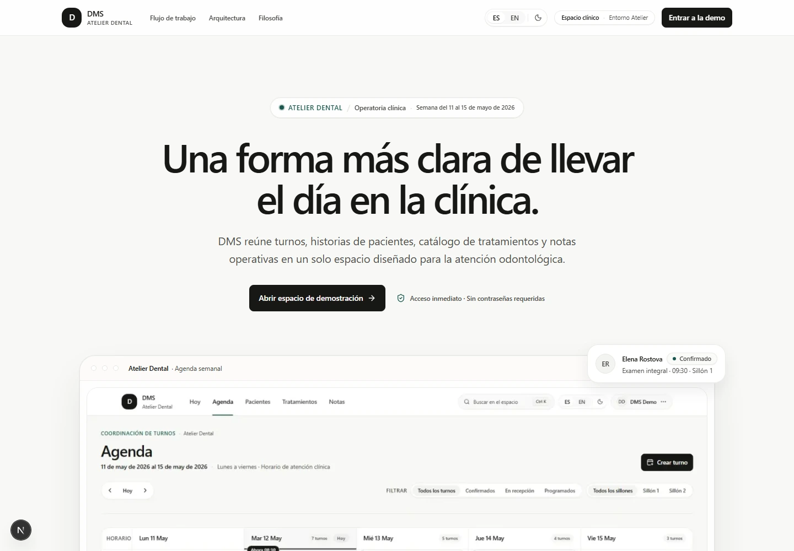
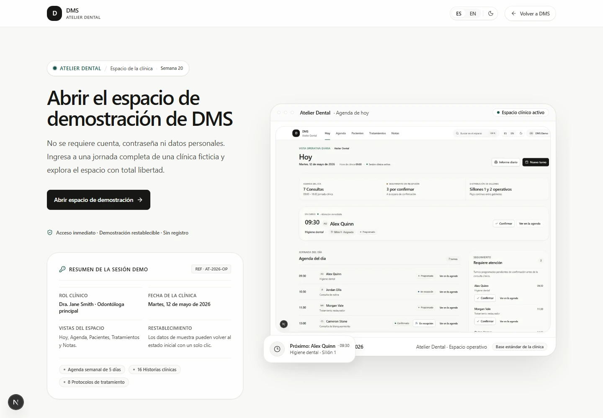
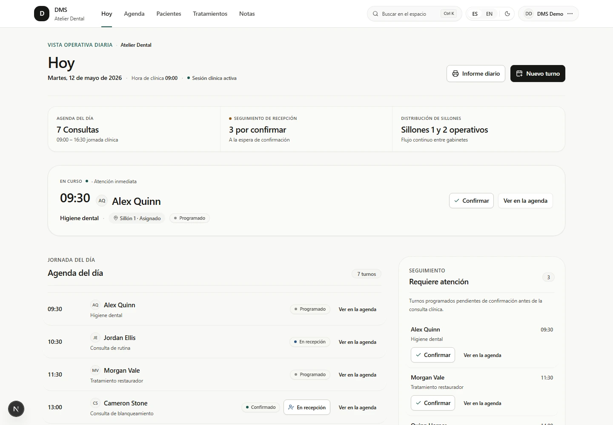
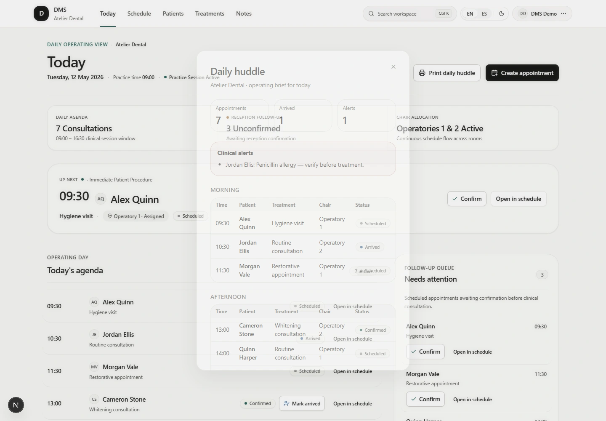
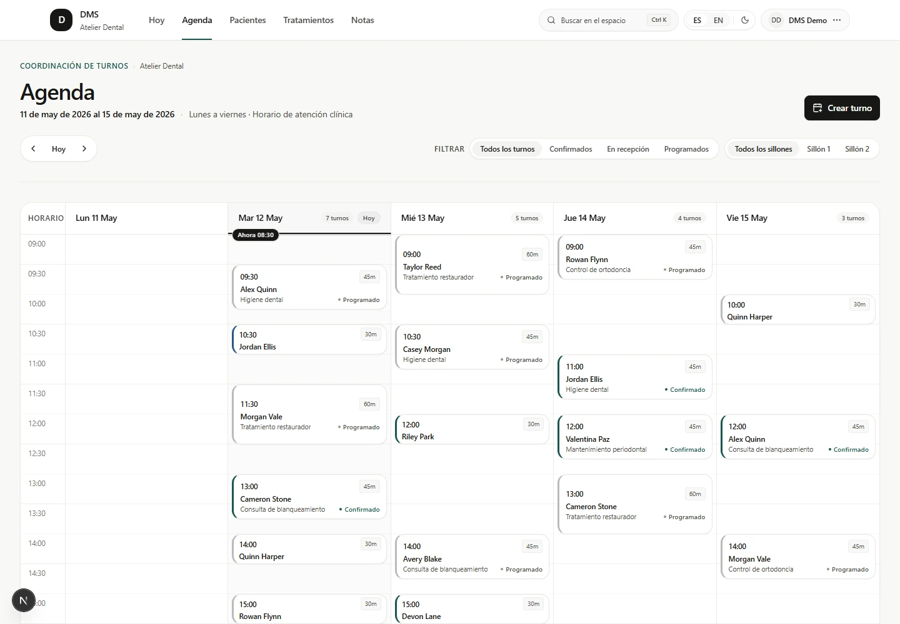
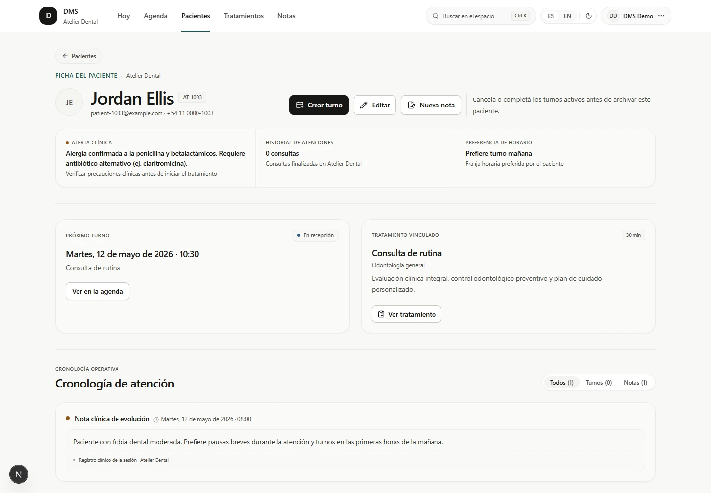

# DMS

[](https://github.com/acevedo-daniel/dms-demo/actions/workflows/ci.yml)

> A public portfolio demo of a dental practice operations workspace.

DMS brings appointments, patient records, a treatment catalog, and operational notes into one workspace for a single dental practice. This independent public portfolio demo is informed by a system delivered with a small team for a dental client. Every practice, person, and record here is fictional.

**[Explore the live demo](https://dms-showcase.vercel.app)**

## Screenshots

### Public entry

| Case study                                                                                                | Demo access                                                                                             |
| --------------------------------------------------------------------------------------------------------- | ------------------------------------------------------------------------------------------------------- |
|  |  |

### Daily operations





### Core workflows

| Weekly schedule                                                                   | Patient record                                                                                              |
| --------------------------------------------------------------------------------- | ----------------------------------------------------------------------------------------------------------- |
|  |  |

## Key capabilities

- **Appointment coordination:** Create, reschedule, confirm, complete, or cancel appointments while preventing conflicting active slots.
- **Clinical flow controls:** Mark patients as arrived, filter the schedule by operatory, open the global `⌘K` command menu, and print a daily huddle brief.
- **Patient directory:** Find, add, edit, archive, and review patients within the sample practice.
- **Connected records:** Keep appointment activity, treatment context, and concise operational notes together on each patient record.
- **Guided public access:** Open a server-provisioned demo session without a public sign-up flow. The resettable fictional dataset can be restored to its curated baseline when needed.

## Engineering highlights

- **Domain rules remain close to persistence.** Focused services enforce practice ownership, appointment overlap checks, and archive constraints through PostgreSQL-backed queries.
- **The public demo is intentionally bounded.** A deterministic clock and resettable seed keep every walkthrough, screenshot, and test run consistent.
- **Authentication is purpose-built for exploration.** Better Auth provisions a server-side demo identity and protects workspace routes without exposing credentials in the interface.
- **Quality checks cover the important boundaries.** Vitest verifies rules and PostgreSQL integration; Playwright covers the main workflow and automated WCAG checks; GitHub Actions runs CI quality checks.
- **The demo closes the loop.** A deterministic clinical huddle, operatory-aware schedule, and arrival lifecycle make the portfolio walkthrough operationally complete.

## Architecture

```text
Browser -> Next.js App Router -> Better Auth + Zod service layer -> Drizzle ORM -> PostgreSQL
```

The application is a modular monolith: server-rendered routes and route handlers compose focused domain services, while Drizzle owns PostgreSQL access and SQL migrations.

## Technology stack

- **Application:** Next.js 16 (App Router), React 19, TypeScript, and Tailwind CSS v4.
- **UI & Primitives:** Radix UI primitives and Lucide React.
- **Data & Identity:** PostgreSQL, Drizzle ORM, Drizzle Kit, Better Auth, and Zod.
- **Testing & Quality:** Vitest, Playwright, `@axe-core/playwright`, Prettier, and ESLint.
- **Tooling & Runtime:** Node.js 24, pnpm 10, Docker Compose, and GitHub Actions.

## Repository structure

| Path                   | Responsibility                                                         |
| ---------------------- | ---------------------------------------------------------------------- |
| `src/app`              | App Router pages, route handlers, metadata, and workspace routes.      |
| `src/components`       | Product UI components, accessible primitives, and client interactions. |
| `src/lib`              | Domain services, validation schemas, auth config, and demo helpers.    |
| `src/db` and `drizzle` | Drizzle schema, deterministic seed data, and versioned SQL migrations. |
| `tests`                | Unit, PostgreSQL integration, end-to-end, and accessibility suites.    |
| `docs`                 | Architectural, developmental, testing, and product documentation.      |

## Local development

Prerequisites: Node.js 24, pnpm 10, and Docker Desktop.

```bash
# Clone and setup environment
cp .env.example .env
pnpm install

# Start local PostgreSQL database
docker compose up -d

# Initialize migrations and deterministic sample data
pnpm db:reset

# Start development server
pnpm dev
```

Open [http://localhost:3000](http://localhost:3000), then select **Explore demo**. The sample environment is intentionally fictional and resettable.

## Quality

```bash
pnpm format:check
pnpm lint
pnpm typecheck
pnpm test
pnpm db:test:up
pnpm test:integration
pnpm test:e2e
pnpm db:test:down
pnpm build
```

Automated CI runs formatting, linting, type checking, unit tests, PostgreSQL integration tests against an isolated container, Playwright end-to-end workflows, automated WCAG accessibility audits, and the production build.

## Documentation

- [Project scope](docs/PROJECT.md) — product scope, clinical domain rules, and business constraints.
- [Architecture](docs/ARCHITECTURE.md) — modular monolith topology, component boundaries, and invariants.
- [Development](docs/DEVELOPMENT.md) — local requirements, environment configuration, and database workflow.
- [Testing](docs/TESTING.md) — verification strategy, test suites, and quality release gates.
- [Security policy](.github/SECURITY.md) — responsible disclosure guidance and demo data privacy.
